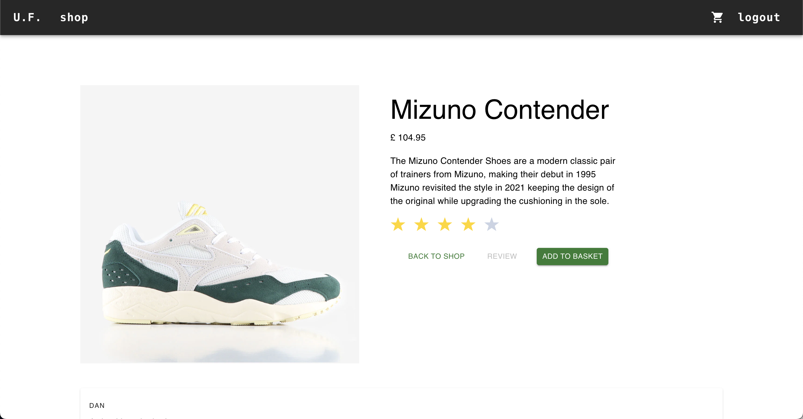

# Urban Footwear Co.
## Overview
Here I have built a fullstack MERN app for a footwear e-commerce site. 

### Technical Requirements
* Use an Express API to serve your data from a Mongo database
* Consume your API with a separate frontend built with React
* Have a complete product with multiple relationships and CRUD functionality and have multiple models


## Built With
* Express
* Node.js
* Mongoose
* MongoDB
* Insomnia
* React.js
* JSX
* CSS
* SASS
* MUI Framework
* Axios
* React-Router-DOM
* Git
* GitHub

## Key Features
* User can register and log in
* Logged in users have the ability to leave a review & rating.
* Reviews can be edited after submission and also deleted


### Stretch Goals
* Superuser/admin has the ability to delete any reviews, however they cannot edit other users reviews.
* Users can add items to basket
* Basket progresses to a checkout page

## Deployed Version
[View the deployed version of the app](https://urban-footwear.netlify.app/)




## Planning
I initially hadn't planned to make an project which I was going to deploy, this was just meant to be a small play around to keep me actively learning, but as I built and changed direction from a full clothing e-commerce site to a shoes only one I gained momentum and built my first full stack solo application. Having a plan would have certainly made life easier at various points, as I would have already thought about which directions I wanted to go in and potential issues. (Next project is going to have an actual plan).

## Challenges 
One of the biggest challenges was deciding how I wanted my project to look, I ultimately decided on doing a semi-clone of [Urban Industry](https://urbanindustry.co.uk), which really helped my inspiration for styling. 

Working out the conditional rendering so Admin user can delete reviews but they cannot edit. I successfully achieved it with the JSX code block below: 

```js
(AUTH.isOwner(addedBy._id) || AUTH.getPayload().isAdmin) && (
  <CardActions>
    {AUTH.isOwner(addedBy._id) && (
      <Button color='success' onClick={toggleEditMode}>
        {isEditMode ? 'cancel' : 'edit review'}
      </Button>
    )}
    <Button color='success' onClick={isEditMode ? saveEditChanges : deleteReview}>
      {isEditMode ? 'save changes' : 'delete review'}
    </Button>
  </CardActions>
)
```

## Bugs 
The one bug I am currently aware of is after you add an item to the basket, if you navigate away from that items show/detail page and then navigate back, the button defaults back to 'add item to basket' again, even though the basket is already populated with said item. I haven't yet managed to work out why this happens. 

## Future improvement
* Fix bug issue mentioned above
* Add shopify/checkout component 
* Add error handling 

## Wins & Key Learnings
* I really enjoyed the process of making a full app alone, previous fulltstack apps had been made as part of a team and doing the journey alone really allowed me to understand my code better
* The working star system for ratings 
* Conditional rendering for buttons when leaving reviews, and admin privileges 
* There is more I'd like to add: such as error handling, and a revamp of the styling too!